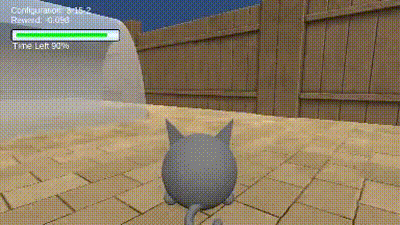
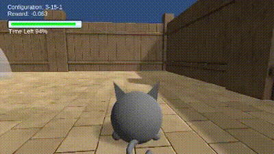
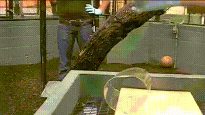

# Animal-AI

Animal-Artificial Intelligence (Animal-AI) supports interdisciplinary research to help better understand human, animal, and artificial cognition. It aims to support AI research towards unlocking cognitive capabilities and better understanding the space of possible minds. It is designed to facilitate testing across animals, humans, and AI. Animal-AI is an active, open-source software engineering and research project.

|  |  |
|---|---|
|  |  |


#### Table of Contents

- [Overview](#overview)
- [Features](#features)
- [Getting Started](#getting-started)
- [Installation](#installation)
- [Citation](#citation)
- [Unity ML-Agents](#unity-ml-agents)
- [The Animal-AI Community](#the-animal-ai-community)


## Overview

- **Website:** [here](https://animalai.org/)
- **Unity/C# Source Code:** [here](https://github.com/Kinds-of-Intelligence-CFI/animal-ai-unity-project)
- **Python Source Code:** [here](https://github.com/Kinds-of-Intelligence-CFI/animal-ai-package/tree/main/animalai)

This repository serves as the primary hub for essential information and activities related to the Animal-AI environment. It contains a collection of in-depth guides to the environment, as well as an extensive library of 900 tasks featured in the inaugural Animal-AI Olympics competition.

_If you wish to contribute to the project, please familiarize yourself with the [Contributing Guide](CONTRIBUTING.md) and the [Code of Conduct](CODE_OF_CONDUCT.md) first._ A comprehensive documentation of how Animal-AI works is also available [here](docs/Technical-Overview.md), where you can understand the inner workings of how the environment is built and how it functions (_csharp_ and _Python_ codebases).

The Animal-AI environment and packages are currently tested on **Windows 11**, **Linux**, and **MacOS**, with **Python 3.9.x** support, but **Python 3.6.x+** has been reported to be working also. **Linux distros** are also working and stable. 


## Features

**Interdisciplinary Research Platform:**
- Facilitates research in human, animal, and artificial cognition
- Supports cross-disciplinary studies
- Enables comparative assessments among humans, animals, and artificial intelligences

**Comprehensive AI Environment:**
- Includes a versatile environment for AI experiments, from basic to advanced configurations
- Wrap Unity learning environments as a gym(nasium) environment
- Wrap Unity learning environments as a PettingZoo environment

**Extensive Task Library:**
- Multiple example tasks for getting started
- 900 tasks from the Animal-AI Olympics competition
- Procedural YAML Configuration File Generation

**Unity Game Engine:**
- Utilizes Unity ML-Agents toolkit for AI training
- Leverages Unity game engine for advanced simulation capabilities
- Fast and robust wrapper

**Cross-Platform Compatibility:**
- Compatible with Windows 11, Linux, and MacOS
- Supports Python 3.6.x and above

**Control Modes:**
- Player mode for interactive environment control, for human testing
- Training mode for Reinforcement Learning, with support for tensorflow analysis
- Supports AI model training across different systems

**Interactive and Dynamic Environment:**
- Offers interactive elements for complex AI training
- Supports dynamic environment generation (dynamic)


## Getting Started

We've prepared a comprehensive set of tutorials to help you get started with the Animal-AI environment. Your first stop should be the [Getting Started Guide](/docs/gettingStarted/Getting-Started.md), which will guide you on where to start and where to go next depending on your interests and experience.


## Installation

*See [here](/docs/gettingStarted/Installation-Guide.md) for a detailed installation guide.*

([latest release](https://github.com/Kinds-of-Intelligence-CFI/animal-ai/releases/tag/v4.0.0)) / ([all releases](https://github.com/Kinds-of-Intelligence-CFI/animal-ai/releases))

For legacy builds of Animal-AI, please see ([legacy releases](/project/AAI-Versions-Archive.md))


## Citation

We published our Version 3 paper on Animal-AI, which you can find [here](https://arxiv.org/abs/2312.11414). If you use Animal-AI in your research, please cite our paper:

 _Voudouris, K., Alhas, I., Schellaert, W., Crosby, M., Holmes, J., Burden, J., Chaubey, N., Donnelly, N., Patel, M., Halina, M,. Hernández-Orallo, J. & Cheke, L. G. (2023). Animal-AI 3: What's New & Why You Should Care. arXiv preprint arXiv:2312.11414._
```
@article{voudouris2023animal,
  title={Animal-AI 3: What's New \& Why You Should Care},
  author={Voudouris, Konstantinos and Alhas, Ibrahim and Schellaert, Wout and Crosby, Matthew and Holmes, Joel and Burden, John and Chaubey, Niharika and Donnelly, Niall and Patel, Matishalin and Halina, Marta and Hernández-Orallo, José and Cheke, Lucy G.},
  journal={arXiv preprint arXiv:2312.11414},
  year={2023}
}
```
For further publications related to Animal-AI, see our website [here](https://sites.google.com/csah.cam.ac.uk/animalai/resources).


## Unity ML-Agents

We implement some of Unity's ML-Agent's toolkit in Animal-AI.

Juliani, A., Berges, V., Vckay, E., Gao, Y., Henry, H., Mattar, M., Lange, D. (2018). [Unity: A General Platform for Intelligent Agents.](https://arxiv.org/abs/1809.02627) *arXiv preprint arXiv:1809.02627*

Documentation for [ML-Agents](https://github.com/Unity-Technologies/ml-agents) should be consulted if you want additional resources.


## The Animal-AI Community 

Animal-AI has been an open-source research project from the beginning, and will continue to be so in the future. We welcome contributions from the community from all backgrounds and experiences, and we are always looking for new ways to collaborate. Do check out our [Contributing Guide](CONTRIBUTING.md) if you are interested in contributing to the project. 

---
