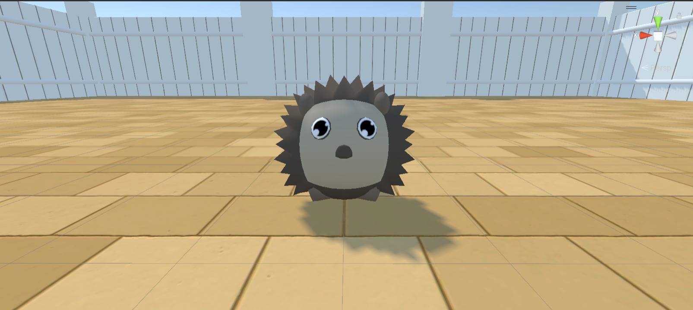

# Arena Environment Guide

#### Table of Contents

* [Introduction](#introduction)
* [The Arena](#the-arena)
* [The Agent](#the-agent)
  + [Agent HUD (Heads-Up Display)](#agent-hud-heads-up-display)
  + [Arena/Agent Limitations](#arenaagent-limitations)
  + [Agent Properties](#agent-properties)
* [GameObjects](#gameobjects)
  + [Unique/Special Object Parameters](#uniquespecial-object-parameters)
  + [Agent-Specific Parameters](#agent-specific-parameters)
  + [Goal-Related Parameters](#goal-related-parameters)
  + [Spawner Parameters](#spawner-parameters)
  + [SignBoard Parameters](#signboard-parameters)
* [Blackouts](#blackouts)
* [Rules and Notes for Arena Configurations](#rules-and-notes-for-arena-configurations)
  + [Spawning GameObjects](#spawning-gameobjects)
  + [Configuration File Values](#configuration-file-values)

## Introduction

This guide will help you understand the structure of the physical Arena Environment developed in Unity. We will explain the various functions of the arena environment, their purposes, and uses. Additionally, we will outline the parameters available for configuring the arena environment and how to use them.

For a detailed explanation of the syntax used in the configuration files, refer to the [YAML Config Syntax](/docs/configGuide/YAML-Config-Syntax.md) guide. This guide assumes a basic understanding of the Unity Engine and is not a comprehensive Unity guide. If you are unfamiliar with Unity, please refer to the [Background - Unity](/docs/Background-Unity.md) guide for an overview and useful links.

## The Arena

<table>
  <tr>

    <td>
    <p>2D view of the Arena</p></td>
    <td><p>First-person view of agent</p></td>
    <td><p>Full view of arena</p></td>

  </tr>
  <tr>

    <td><p>Close-up of arena ground</p></td>
    <td><p>Third Persion view of one of the agent skins</p></td>
    <td><p>Side view of walls</p></td>

  </tr>
</table>

Each **episode** (a single run) contains an _arena_ environment. Currently, an arena supports only a single agent (with spherical animal skins - _hedgehog_, _pig_, or _panda_). The arena is a fixed size of `40x40` , with the origin set at `(0,0)` . Object coordinates can be provided in the range `[0,40]x[0,40]` as floats.

The default arena consists of several gameobjects contained in a _Unity Scene_, including:

* **Walls**: Four walls, each 10 units high and 40 units long, named `Wall1`,  `Wall2`,  `Wall3`, and `Wall4`. Each wall has child objects called `fences`, which contain the textures. All walls are children of the `Walls` gameobject, which is itself a child of the `Arena` gameobject.
#####
* **Ground**: The ground, 40 units long and 40 units wide, is a child of the `Arena` gameobject.
#####
* **Lights**: Four spotlights, one at each corner of the arena. These lights are children of the `Lights` gameobject, which is a child of the `Arena` gameobject.
#####
* **SpawnArea**: This gameobject is responsible for spawning objects defined in the configuration file. It is a child of the `Arena` gameobject and controls the size of the spawn area, currently set within the arena walls.
#####
* **Agent**: The agent, which must be spawned in every arena, is the main character for playing and training. It is a child of the `Arena` gameobject.

<p align="center">
  
</p>

In the above picture with the agent on the ground in the center of the environment its coordinates are `(20, 0, 20)` . Below is a sample configuration file for the default arena as shown above:

```YAML
!ArenaConfig
randomizeArenas: false
showNotification: false 
canResetEpisode: true 
canChangePerspective: true 
arenas:
  n: !Arena # note that the n is a placeholder integer between 0 and n, but the first arena must start with 0
    #pass_mark: 0 # This syntax is only supported for AAI builds less than v4.0.0. If you are using newer versions, please use the 'passMark' syntax.
    passMark: 0 # The pass mark for the arena. The agent must achieve this score to pass the arena.
    #t: 250 # This syntax is only supported for AAI builds less than v4.0.0. If you are using newer versions, please use the 'timeLimit' syntax.
    timeLimit: 250 # The time limit for the arena in seconds. In other words, the time limit for the agent to complete the task (the arena resets after this time).
    items:
    - !Item
      name: Agent
      positions:
      - !Vector3 {x: 20, y: 0, z: 20}
      rotations: [0]
```

* `(n): !Arena` - an `int` denoting the unique arena index used to identify the arena in the configuration file. The first arena must start with `0` and go up to `n`, where `n` is the total number of arenas defined in a single configuration file. 
#####
* `timeLimit` - an `int` defining the length of an episode. A value of `0` means the episode will not end until a reward is collected (setting `timeLimit=0` and having no reward will result in an infinite episode). This value translates into a decay rate for the agent's health. For instance, a `timeLimit` of 100 means the agent's health will decay to 0, ending the episode after 100 time steps. **Note: Supported in AAI builds v4.0.0 and below as `t`. Replaced by `timeLimit` in AAI builds v4.1.0 and above.**
#####
* `passMark` - an `int` defining the reward threshold for passing the environment. If undefined, the default value is 0, meaning any reward obtained by the agent results in a pass. This parameter also determines end-of-episode notifications. Set this parameter considering the feasible reward size in each configuration file. **Note: Supported in AAI builds v4.0.0 and below as `pass_mark`. Replaced by `passMark` in AAI builds v4.1.0 and above.**
#####
* `canChangePerspective` - a `bool` indicating whether the agent can change its camera perspective during an episode (first-person, third-person, or eagle-view). If `false`, the agent cannot change perspective using the C button. If `true`, perspective changes are allowed. Default is `true`.
#####
* `randomizeArenas` - a `bool` indicating whether the arena will be randomized between episodes. If `true`, arenas are randomized as defined in the configuration file. If `false`, arenas are spawned sequentially as specified. Default is `false`.
#####
* `showNotification` - a `bool` indicating whether the player receives a notification at the end of an episode. If `true`, a notification is shown for approximately 2.5 seconds before moving to the next episode. If `false`, episodes terminate back-to-back without notifications. Default is `false`.
#####
* `blackouts` - a `list` defining the frames at which the lights are on or off during an episode. If omitted, lights remain on for the entire episode. For more information on blackouts, [see here](#blackouts).

**N. B:** These parameters are optional (except `timeLimit` and `passMark` ) and can be omitted from the configuration file. If omitted, default values are used, detailed in the [YAML Config Syntax](/docs/configGuide/YAML-Config-Syntax.md) guide.

## The Agent

The agent is the main character in the arena, for playing and training. It is a spherical animal with a set of controls that can be used to move it around the arena. The agent can be configured to have a set of different skins, which can be specified in the configuration file, under it's parameters. The agent has a set of controls that can be used to move it around the arena. 

The controls are as follows:

* `W` - move forward
* `A` - move left
* `S` - move backward
* `D` - move right
* `C` - change camera perspective (first-person, third-person, eagle-view, only if `canChangePerspective` is `true`)
* `R` - reset the arena (cycles to the next episode if `canResetEpisode` is `true`)
* `Q` - quit (exits the application upon press)

The agent has a set of skins that can be used to change its appearance in the arena. The skins are as follows:

* `panda`
* `pig`
* `hedgehog`

<table>
  <tr>

    <td>
    <p>Panda Skin</p></td>
    <td><p>Pig Skin</p></td>
    <td><p>Hedgehog Skin</p></td>

  </tr>
</table>

### Agent HUD (Heads-Up Display)

The agent has a HUD that displays the following information per episode by default:

* **Health**: The health of the agent, a value between `0` and `1`. The agent's health decays over time and resets to `1` when a reward is collected. It is displayed as a green-yellow-red bar at the bottom of the HUD.
  
* **Reward**: The reward collected by the agent, ranging between `-1` and `1`. The reward is displayed as text at the top of the HUD, updated in real-time. It shows the previous episode's reward (not valid if the current arena is the first) and the current episode's reward.
  
* **Episode Notification**: A notification displayed at the end of an episode, consisting of color gradients and a short animated GIF. This HUD element is optional and only appears if the `showNotification` parameter is set to `true` in the configuration file. _Note: This feature is only for play mode and does not affect training._

| 

     | 

      |
| ------------------------------------------------ | ------------------------------------------------- |
| 

 | 

 |

### Arena/Agent Limitations

Consider the following limitations of the arena and agent:

1. **Single Agent Per Arena/Episode**: Only one agent is supported per arena or episode, applicable to both play and training modes.
2. **Movement Constraints**: The agent can only move on the ground and cannot navigate on walls or other objects, except when placed on top of flat-surfaced objects.
3. **Object Interaction**: The agent cannot move through objects, except for hot/death zones.
4. **No Jumping or Flying**: The agent is restricted to ground movement and cannot jump or fly.
5. **Object Handling**: The agent cannot pick up objects. This feature is planned for future updates.
6. **Arena Reset**: The arena resets only when the agent's health reaches `0` or when the `R` key is pressed (in play mode). This limits episode-to-episode flexibility.
7. **Spawning Logic**: The spawning logic prioritizes the agent over other objects, with objects spawning in the order defined in the configuration file. This restricts more complex or flexible spawning logic.

### Agent Properties

The agent has a Physics component attached, allowing it to interact with other objects in the arena. For more information on Unity's physics, please refer to our [Background - Unity](/docs/Background-Unity.md) guide.

_Essentially, Unity's Physics engine mimics three-dimensional reality as closely as possible_. The agent's properties are as follows:

* **Scale**: The agent's default scale is `1x1x1`.
* **Mass**: The agent's default mass is `100`.
* **Drag**: The agent's default drag is `1.2`.
* **Angular Drag**: The agent's default angular drag is `0.05`.
* **Gravity**: Enabled by default, causing the agent to fall to the ground if its `y` coordinate is greater than `0`.
* **Speed**: The agent moves at a speed of `30` when the `W`,  `A`,  `S`, and `D` keys are pressed. Speed is affected by the `drag` and `angular drag` properties, causing the agent to slow down over time if the keys are not pressed.
* **Rotation Speed**: The agent rotates at a speed of `100` when the `A` and `D` keys are pressed. This speed is unaffected by the `drag` and `angular drag` properties.
* **Rotation Angle**: The rotation angle is `0.25`, dictating the angle at which the agent rotates when the `A` and `D` keys are pressed. This angle is unaffected by the `drag` and `angular drag` properties.

## Game Objects

All objects can be configured using a set of parameters for each `item` Unity Game Object:

* **`name`**: The name of the object you want to spawn, which must match the object name specified in [Arena Object Definitions](/docs/Arena-Object-Definitions.md). You can spawn the same object multiple times, but they must be in different positions.
#####
* **`positions`**: A list of `Vector3` positions within the arena where you want to spawn items. If the list is empty, the position will be sampled randomly in the arena. Any position vector set to -1 will spawn randomly. Note that Animal-AI enforces a constraint where objects cannot spawn within 0.1 units of each other to avoid collisions.
#####
* **`sizes`**: A list of `Vector3` sizes. If the list is empty, the size will be sampled randomly within preset bounds for that object. Any size set to -1 will spawn randomly along that vector only.
#####
* **`rotations`**: A list of `float` values in the range `[0,360]`. If the list is empty, the rotation is sampled randomly. The default is 0 degrees.
#####
* **`colors`**: A list of `RGB` values (integers in the range `[0,255]`). If the list is empty, the color is sampled randomly. Note that not all objects can have their color changed; for those (e.g., transparent objects), this value will be ignored.

**Note**: Any of these parameters can be omitted in the configuration files per object. Omitted fields are automatically randomized. However, specifying these parameters allows for a more controlled environment in your arena(s). Any `Vector3` that contains a -1 for any of its dimensions will spawn that dimension randomly (e.g., `x: -1, y: 10, z: 2` will spawn the object randomly along the x-axis). Some objects have specific parameters applicable only to them, which are described in the [Unique/Special Objects](#uniquespecial-object-parameters).

**All value ranges for the above fields can be found in the [Arena Object Definitions](/docs/Arena-Object-Definitions.md) guide**. If you go above or below the range for size, it will automatically be set to the max or min, respectively. If you try to spawn objects outside the arena (e.g., `x = 41, z = 41` ) or overlapping with another object with very close spawn positions, the overlapping object will not be spawned. Objects are placed in the order defined, so the second overlapping object will not spawn.

## Unique/Special Object Parameters

Some objects have unique or special parameters that only apply to them or a select few objects. These parameters can be written in the configuration file in the same way as the standard parameters but will only be applied if assigned to a valid object.

### Agent-Specific Parameters

* **Skins**:
  List of animal skins for the agent model.
  + **Applies to:** Agent
  + **Default:** "random" (any animal from the list)
  + **Options:** "panda", "pig", "hedgehog", "random", etc.

* **Frozen Agent Delays**:
  Time (in frames) the agent is frozen at the start of an episode.
  + **Applies to:** Agent
  + **Default:** 0 (no delay)
  + **Options:** n (delay of n frames)

### Goal-Related Parameters

* **Delays**:
  Time delay before special behavior initiation.
  + **Applies to:** DecayGoal, AntiDecayGoal, GrowGoal, ShrinkGoal, SpawnerTree, SpawnerDispenser, SpawnerContainer
  + **Default:** 0

* **Initial Values**:
  Starting reward/size values.
  + **Applies to:** DecayGoal, AntiDecayGoal, GrowGoal, ShrinkGoal, SpawnerTree
  + **Default:** Varies by goal type

* **Final Values**:
  Ending reward/size values.
  + **Applies to:** DecayGoal, AntiDecayGoal, GrowGoal, ShrinkGoal, SpawnerTree
  + **Default:** Varies by goal type

* **Change Rates**:
  Rate at which reward/size changes.
  + **Applies to:** DecayGoal, AntiDecayGoal, GrowGoal, ShrinkGoal
  + **Default:** 0.005 (negative for decaying/shrinking)

### Spawner Parameters

* **Spawn Counts**:
  Number of goals spawned.
  + **Applies to:** SpawnerTree, SpawnerDispenser, SpawnerContainer
  + **Default:** -1 (infinite)

* **Spawn Colors**:
  Color of spawned objects.
  + **Applies to:** SpawnerTree, SpawnerDispenser, SpawnerContainer
  + **Default:** Varies by spawner

* **Times Between Spawns**:
  Interval between spawns.
  + **Applies to:** SpawnerTree, SpawnerDispenser, SpawnerContainer
  + **Default:** 4.0 for trees, 1.5 otherwise

* **Ripen Times**:
  Duration for goals to ripen in a tree.
  + **Applies to:** SpawnerTree
  + **Default:** 6.0

* **Door Delays**:
  Time for a spawner's door to open.
  + **Applies to:** SpawnerDispenser, SpawnerContainer
  + **Default:** 10.0

* **Times Between Door Opens**:
  Interval for a spawner's door to open.
  + **Applies to:** SpawnerDispenser, SpawnerContainer
  + **Default:** -1 (stays open once opened)

### SignBoard Parameters

* **Symbol Names**:
  Names of symbols to be drawn.
  + **Applies to:** SignBoard
  + **Default:** "default"
  + **Options:** "left-arrow", "right-arrow", etc.

## Blackouts

_Blackouts_ define when the lights are on or off during an episode in each arena, resulting in a black screen/view in any camera angle. This is an optional parameter in the configuration file, and can be omitted if you don't want to use it. If omitted, the lights will be on for the entire episode.

* **Default Behavior**: Lights are on for the entire episode if no blackout parameter is provided.
* **List of Frames**: Provide a list like `[5,10,15,20,25]` to toggle lights. Lights will be off between frames 5-9, 15-19, etc., and on at other times.
* **Regular Intervals**: Use a negative number like `[-20]` to toggle lights every 20 frames.
* **Infinite Episodes**: For episodes with `t=0`, lights will follow the pattern indefinitely.

**Note**: With a list of frames, the lights will stay off after the last frame in the list for infinite episodes. 

See the [YAML Config Syntax](/docs/configGuide/YAML-Config-Syntax.md) guide for a detailed tutorial on how to use blackouts.

## Rules and Notes for Arena Configurations

When configuring an arena, follow these rules and be aware of certain behaviors:

### Spawning GameObjects

* **Non-Overlapping**: Objects spawn only if they don't overlap with others. Overlapping attempts discard the latter object to avoid runtime collision issues.
* **Spawn Order**: Objects are spawned in the order listed. Randomized objects attempt to spawn up to 20 times; if unsuccessful, they are discarded.
* **Spawn Likelihood**: Objects listed earlier are more likely to spawn as the file is scanned from top to bottom.
* **Agent Spawning**:
  - The Agent spawns randomly within arena bounds if no position is specified.
  - Specified Agent positions are processed first, potentially conflicting with later objects.
  - If an object tries to spawn at the Agent's position, the Agent takes priority to avoid runtime conflicts.
  - Some objects can spawn on top of each other with a `0.1` height buffer.

### Configuration File Values

* **n: !Arena**: `n` is an integer from `0` to the total number of arenas defined. The first arena starts at `0`, up to `n`. Negative numbers are converted to positive integers for flexible arena management.
* **Object Names**: Must match names from [Arena Object Definitions](/docs/Arena-Object-Definitions.md). Unmatched names are ignored.
* **Randomization**: Use `-1` or leave blank in `positions`, `sizes`, and `rotations` for random values where supported.
* **Ground Level Spawning**: Setting `positions.y = 0` spawns objects at ground level with a `0.1` height buffer.
* **Goal Scaling**: Goals (except red zones) scale equally on all axes. For sphere goals, only the `x` component of `Vector3` scales all axes.
* **Arena Height Bounds**: Objects can spawn at any height within the arena. Recommended height range is `0` to `50` units. Heights above `50` units may cause objects to fall from the sky, which can take time depending on their mass and drag.
* **Arena Size Bounds**: The arena is a fixed `40x40` square with coordinates ranging from `[0,40]x[0,40]`. Coordinates outside this range will be discarded. Arena size configurability is planned for the future.