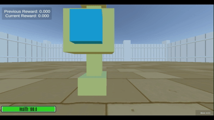
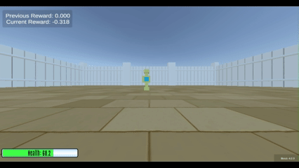
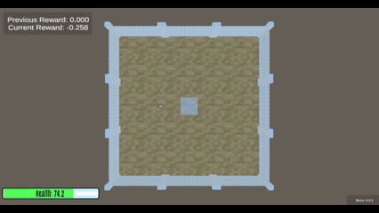
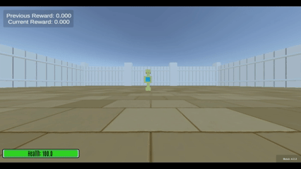

# Interactive Object Operations

<span style="color: grey;">Available from AAI 4.3.0</span>

#### Table of Contents

- [Introduction](#introduction)
- [Basic Operations](#basic-operations)
  - [Toggle Object](#toggle-object)
  - [Grant Reward](#grant-reward)
  - [Grant Continuous Reward](#grant-continuous-reward)
  - [End Episode](#end-episode)
  - [Freeze Agent](#freeze-agent)
  - [None Operation](#none-operation)
- [Complex Operations](#complex-operations)
  - [Limited Invocations](#limited-invocations)
  - [Operation From List](#operation-from-list)

## Introduction

Interactive objects (currently, the SpawnerButton and Datazone) can be configured with 'operations' to customise their behaviour. Operations represent a simple action, and can be composed to form more complex behaviours. This page documents each operation, and gives examples of how to use it.

## Basic Operations
### Toggle Object
Spawn and despawn a specified object.

**Name:** toggleObject

**objectInitiallyPresent:** [true, false] (specifies if the object is there when the arena starts)

**spawnAndForget:** [true, false] (makes each time the operation is invoked spawn a new object, e.g. to have a button spawn many non episode ending goals. Defaults to false)

**spawnable:** Item (item to spawn, can be any object that would be specified with !Item)

**Note:** To have an operation that spawns an object only once, this operation can be composed with the [limited invocations](#limited-invocations) operation.

**Example**
```
!ArenaConfig
arenas:
  0: !Arena
    passMark: 0
    timeLimit: 0
    items:
    - !Item
      name: Agent
      positions:
      - !Vector3 {x: 20, y: 0, z: 20}
      rotations: [0]
    - !Item
      name: SpawnerButton
      positions:
      - !Vector3 {x: 20, y: 0, z: 25}
      rotations: [90]
      moveDurations: [0.1]
      resetDurations: [0.1]
      operations:
      - !toggleObject
          objectInitiallyPresent: true
          spawnAndForget: false
          spawnable: !Item
            name: GoodGoal
            sizes:
            - !Vector3 {x: 1, y: 1, z: 1}
            positions:
            - !Vector3 {x: 15, y: 1, z: 30}
```



### Grant Reward
Grant a specified reward amount.

**Name:** grantReward

**reward:** Number (Value of the reward to grant)

**Example**
```
!ArenaConfig
arenas:
  0: !Arena
    passMark: 0
    timeLimit: 250
    items:
    - !Item
      name: Agent
      positions:
      - !Vector3 {x: 20, y: 0, z: 20}
      rotations: [0]
    - !Item
      name: SpawnerButton
      positions:
      - !Vector3 {x: 20, y: 0, z: 25}
      rotations: [90]
      moveDurations: [0.1]
      resetDurations: [0.1]
      operations:
      - !grantReward
        reward: 0.3
```



### Grant Continuous Reward
Grant a specified reward amount each timestep.

**Name:** grantContinuousReward

**rewardPerStep:** Number (Value of the reward to grant per timestep)

**Example**
```
!ArenaConfig
arenas:
  0: !Arena
    timeLimit: 250
    items:
    - !Item
      name: Agent
      positions:
      - !Vector3 {x: 10, y: 0, z: 20}
      rotations: [90]
    - !Item
      name: DataZone
      positions:
      - !Vector3 {x: 20, y: 0, z: 20}
      sizes:
      - !Vector3 {x: 5, y: 0, z: 5}
      rotations: [0]
      zoneVisibility: true
      operations:
      - !grantContinuousReward
        rewardPerStep: 0.005
```


### End Episode
End the current episode, with a specified reward

**Name:** endEpisode

**reward:** Number (Additional reward to grant at the end of the episode. Defaults to 0)

**Note:** To have the reward default to 0, use curly braces after the operation name: `- !endEpisode {}`

**Example**
```
!ArenaConfig
arenas:
  0: !Arena
    passMark: 0
    timeLimit: 250
    items:
    - !Item
      name: Agent
      positions:
      - !Vector3 {x: 20, y: 0, z: 20}
      rotations: [0]
    - !Item
      name: SpawnerButton
      positions:
      - !Vector3 {x: 20, y: 0, z: 25}
      rotations: [90]
      moveDurations: [0.1]
      resetDurations: [0.1]
      operations:
      - !endEpisode
        reward: 3
```


### Freeze Agent
Stops the agent moving (all directional inputs are ignored) for a fixed number of timesteps.

**Name:** freezeAgent

**freezeSteps:** Integer (The number of steps to freeze for)

**Note:** The steps used are Unity [FixedUpdate](https://docs.unity3d.com/6000.2/Documentation/Manual/fixed-updates.html) steps, which is the frequency at which Unity updates its physics simulation.

**Example**
```
!ArenaConfig
arenas:
  0: !Arena
    passMark: 0
    timeLimit: 250
    items:
    - !Item
      name: Agent
      positions:
      - !Vector3 {x: 20, y: 0, z: 20}
      rotations: [0]
    - !Item
      name: SpawnerButton
      positions:
      - !Vector3 {x: 20, y: 0, z: 25}
      rotations: [90]
      moveDurations: [0.1]
      resetDurations: [0.1]
      operations:
      - !freezeAgent
          freezeSteps: 50
```

### None Operation
A dummy operation that does nothing.

**Name:** noneOperation

**Example**
```
!ArenaConfig
arenas:
  0: !Arena
    passMark: 0
    timeLimit: 250
    items:
    - !Item
      name: Agent
      positions:
      - !Vector3 {x: 20, y: 0, z: 20}
      rotations: [0]
    - !Item
      name: SpawnerButton
      positions:
      - !Vector3 {x: 20, y: 0, z: 25}
      rotations: [90]
      moveDurations: [0.1]
      resetDurations: [0.1]
      operations:
      - !noneOperation {}
```
## Complex Operations
Complex operations take operations as arguments, and so can be composed to make more complex behaviours.

### Multiple simultaneous operations
Multiple operations can be executed simulataneously by listing them in the `operations` argument.

**Example**
```
!ArenaConfig
arenas:
  0: !Arena
    passMark: 0
    timeLimit: 0
    items:
    - !Item
      name: Agent
      positions:
      - !Vector3 {x: 20, y: 0, z: 20}
      rotations: [0]
    - !Item
      name: SpawnerButton
      positions:
      - !Vector3 {x: 20, y: 0, z: 25}
      rotations: [90]
      moveDurations: [0.1]
      resetDurations: [0.1]
      operations:
      - !toggleObject
          objectInitiallyPresent: false
          spawnAndForget: false
          spawnable: !Item
            name: GoodGoal
            sizes:
            - !Vector3 {x: 1, y: 1, z: 1}
            positions:
            - !Vector3 {x: 15, y: 1, z: 30}
      - !toggleObject
          objectInitiallyPresent: false
          spawnAndForget: false
          spawnable: !Item
            name: GoodGoal
            sizes:
            - !Vector3 {x: 1, y: 1, z: 1}
            positions:
            - !Vector3 {x: 25, y: 1, z: 30}
```



### Limited Invocations
Only allow an operation to occur a certain number of times, after which invocations of the operation are ignored.

**Name:** limitedInvocationsOperation

**maxInvocations:** Integer (Stops the operation from occurring after it happens this number of times)

**operation:** Operation (The operation to limit the invocations of)

```
!ArenaConfig
arenas:
  0: !Arena
    passMark: 0
    timeLimit: 0
    items:
    - !Item
      name: Agent
      positions:
      - !Vector3 {x: 20, y: 0, z: 20}
      rotations: [0]
    - !Item
      name: SpawnerButton
      positions:
      - !Vector3 {x: 20, y: 0, z: 25}
      rotations: [90]
      moveDurations: [0.1]
      resetDurations: [0.1]
      operations:
      - !limitedInvocationsOperation
        maxInvocations: 3
        operation: !toggleObject
          objectInitiallyPresent: false
          spawnAndForget: true
          spawnable: !Item
            name: GoodGoal
            sizes:
            - !Vector3 {x: 1, y: 1, z: 1}
            positions:
            - !Vector3 {x: 15, y: 5, z: 30}
```


### Operation From List
Randomly choose an action from the list, optionally according to a specified weighting.

**Name:** operationFromList

**operations:** List of operations (To be selected from randomly)

**operationWeights:** List of numbers (The weighting to be used, should be the same length as the list of operations. Defaults to uniform weighting)

**Examples**
```
!ArenaConfig
arenas:
  0: !Arena
    passMark: 0
    timeLimit: 0
    items:
    - !Item
      name: Agent
      positions:
      - !Vector3 {x: 20, y: 0, z: 20}
      rotations: [0]
    - !Item
      name: SpawnerButton
      positions:
      - !Vector3 {x: 20, y: 0, z: 25}
      rotations: [90]
      moveDurations: [0.1]
      resetDurations: [0.1]
      operations:
      - !operationFromList
        operations:
        - !toggleObject
          objectInitiallyPresent: false
          spawnAndForget: true
          spawnable: !Item
            name: GoodGoal
            sizes:
            - !Vector3 {x: 1, y: 1, z: 1}
            positions:
            - !Vector3 {x: 15, y: 5, z: 30}
        - !toggleObject
          objectInitiallyPresent: false
          spawnAndForget: true
          spawnable: !Item
            name: GoodGoal
            sizes:
            - !Vector3 {x: 1, y: 1, z: 1}
            positions:
            - !Vector3 {x: 25, y: 5, z: 30}
        operationWeights:
        - 3
        - 1
```

