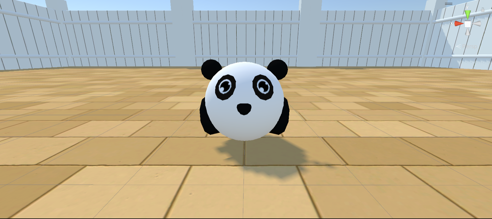

# Arena Environment Guide

#### Table of Contents
1. [Introduction](#introduction)
2. [The Arena](#the-arena)
3. [The Agent](#the-agent)
   - [Arena Limitations](#arena-limitations)
   - [Agent Properties](#agent-properties)
   - [Complex Agent Properties (ML-Agents / Training)](#complex-agent-properties-ml-agents--training)
4. [GameObjects](#gameobjects)
5. [Unique/Special Object Parameters](#uniquespecial-object-parameters)
   - [Agent-Specific Parameters](#agent-specific-parameters)
   - [Goal-Related Parameters](#goal-related-parameters)
   - [Spawner Parameters](#spawner-parameters)
   - [SignBoard Parameters](#signboard-parameters)
6. [Blackouts](#blackouts)
7. [Rules and Notes for Arena Configurations](#rules-and-notes-for-arena-configurations)
   - [Spawning GameObjects](#spawning-gameobjects)
   - [Configuration File Values](#configuration-file-values)


## Introduction

This guide will help you understand the structure of the physical Arena Environment as developed in Unity. We will explain the various functions of the arena environment, and their purposes and uses. We will also outline the various parameters that can be used to configure the arena environment, and how to use them. Please see the [YAML Config Syntax](docs\configGuide\YAML-Config-Syntax.md) guide for a detailed explanation of the syntax used in the configuration files for additional information. Be aware that this guide is not a comprehensive guide to Unity, and assumes that you have a basic understanding of the Unity Engine. If you are unfamiliar with Unity, please refer to the [Background - Unity](docs\Background-Unity.md) guide for a brief overview of the Unity Engine as well as relevant useful links.


## The Arena

<table>
  <tr>
    <td>
    <p>2D view of the Arena</p></td>
    <td><p>First-person view of agent</p></td>
    <td><p>Full view of arena</p></td>
  </tr>
  <tr>
    <td><p>Close-up of arena ground</p></td>
    <td><p>Third Persion view of one of the agent skins</p></td>
    <td><p>Side view of walls</p></td>
  </tr>
</table>

The default arena instance is shown above, with just the arena (walls and ground gameobjects) and the agent spawned. Currently, an arena can only support a single agent (with spherical animal skins - _hedgehog_, _pig_, or _panda_). It is currently a square of fixed size `40x40`, meaning the size of the arena is immutable, with the origin of the arena is set to `(0,0)`. You can provide coordinates for objects in the range `[0,40]x[0,40]` as floats.

The arena is made up of a set of gameobjects, which are as follows:

- **Walls**: The walls of the arena, which are 10 units high and 40 units long. The walls are made up of 4 gameobjects, one for each wall, which are named `Wall1`, `Wall2`, `Wall3`, and `Wall4`, each with a set of childobjects called `fences`, which contain the textures for the walls. The walls are all children of the `Walls` gameobject, which is itself a child of the `Arena` gameobject.
- **Ground**: The ground of the arena, which is 40 units long and 40 units wide. The ground is a child of the `Arena` gameobject.
- **Lights**: The lights of the arena, which are 4 spotlights, one for each corner of the arena. The lights are all children of the `Lights` gameobject, which is a child of the `Arena` gameobject.
- **SpawnArea**: The spawn gameobject responsible for spawning objects defined in the configuration file, which is a child of the `Arena` gameobject. This gameobject essentially controls the size of the spawn area, currently set to within the bounds of the walls of the arena.
- **Agent**: The agent, which is a child of the `Arena` gameobject, must be spawned in every arena.

<p align="center">
  
</p>

In the above picture with the agent on the ground in the center of the environment its coordinates are `(20, 0, 20)`. Below is a sample configuration file for the default arena as shown above:

```YAML
!ArenaConfig
randomizeArenas: false
showNotification: false 
canResetEpisode: true 
canChangePerspective: true 
arenas:
  0: !Arena
    pass_mark: 0
    t: 250
    items:
    - !Item
      name: Agent
      positions:
      - !Vector3 {x: 20, y: 0, z: 20}
      rotations: [0]
```

- `t` an `int`, defines the length of an episode which can change from one episode to the other. A value of `0` means that the episode will not terminate until a reward has been collected (setting `t=0` and having no reward will lead to an infinite episode). This value is converted into a decay rate for the health of the agent. A `t` of 100 means that the agent's health will decay to 0, and the episode will end, after 100 time steps.
- `pass_mark` an `int`, defines the reward threshold that should constitute a ‘pass’ in the enviroment. Leaving this parameter undefined leads to the default value of 0, whereby any reward value obtained by the Agent results in a pass. This parameter also determines the notifications that players receive at the end of an episode. If used, this parameter should be defined with consideration to the reward size that can feasibly be obtained by the agent in each configuration file.
- `canChangePerspective` a `bool`, defines whether the agent can change its camera perspective during an episode (first-person, third-person or eagle-view). If set to `false`, the agent will be unable to change its camera perspective during an episode by pressing the C button on their keyboards, which will cycle through the cameras attached to the Agent in-gasme. If set to `true`, the agent will be able to change its perspective during an episode. This parameter is set to `true` by default.
- `randomizeArenas` a `bool`, defines whether the arena will be randomized between episodes. If set to `true`, the arena will be randomized between the defined Arenas in the configuration file. If set to `false`, the order to which the arenas are spawned are sequential and top-to-bottom as specified in the configuration file. This parameter is set to `false` by default.
- `showNotification` a `bool`, defines whether the player will receive a notification at the end of an episode. If set to `true`, the player will be shown a notification at the end of an episode for approximately 2.5 seconds, then move on to the next episode (arena). If set to `false`, the agent will not receive a notification at the end of an episode and episode-to-episode termination is back-to-back. This parameter is set to `false` by default.
- `blackouts` a `list`, defines the frames at which the lights are on or off during an episode. If omitted, the lights will be on for the entire episode. For more information on blackouts, [see here](#blackouts)

**N.B:** These parameters are optional (except `t` and `pass_mark`) and can be omitted from the configuration file. If omitted, the default values will be used, which are explained in detail in our [YAML Config Syntax](docs\configGuide\YAML-Config-Syntax.md) guide.

## The Agent

The agent is the main character in the arena, for playing and training. It is a spherical animal with a set of controls that can be used to move it around the arena. The agent can be configured to have a set of different skins, which can be specified in the configuration file, under it's parameters. The agent has a set of controls that can be used to move it around the arena. 

The controls are as follows:

- `W` - move forward
- `A` - move left
- `S` - move backward
- `D` - move right
- `C` - change camera perspective (first-person, third-person, eagle-view, only if `canChangePerspective` is `true`)
- `R` - reset the arena (cycles to the next episode if `canResetEpisode` is `true`)
- `Q` - quit (exits the application upon press)

<table>
  <tr>
    <td>
    <p>Hedgehog</p></td>
    <td><p>Panda</p></td>
    <td><p>Pig</p></td>
</table>

### Arena Limitations

The arena has a few limitations, which are as follows:

1. Only a single agent _per_ arena is supported, both for play and training.
2. The agent can only move on the ground, and cannot move on the walls.
3. The agent cannot move through objects (except for the hot/death zones).
4. The agent cannot jump or fly. 

### Agent Properties

The agent has a Phydics component attached to it, which allows it to interact with other objects in the arena. Please read our [Background - Unity](docs\Background-Unity.md) guide for more information. 

_Essentially, you can expect that the Physics of Unity game engine are modelled to mimic our three-dimensional reality as much as possible_. The agent has the following properties:

- **Scale**: The scale of the agent, which is set to `1x1x1` by default.
- **Mass**: The mass of the agent, which is set to `100` by default.
- **Drag**: The drag of the agent, which is set to `1.2` by default.
- **Angular Drag**: The angular drag of the agent, which is set to `0.05` by default.
- **Gravity**: Enabled for the agent (and for all other objects for that matter), which means that it will fall to the ground when spawned if it's `y` coordinate `> 0`.
- **Speed**: The speed of the agent, which is set to `30` by code. This is the speed at which the agent moves when the `W`, `A`, `S`, and `D` keys are pressed. Note that the speed of the agent is affected by the `drag` and `angular drag` properties, which means that the agent will slow down over time if the keys are not pressed.
- **Rotation Speed**: The rotation speed of the agent, which is set to `100` by code. This is the speed at which the agent rotates when the `A` and `D` keys are pressed. Rotation speed is unaffected by the `drag` and `angular drag` properties.
- **Rotation Angle**: The angle of rotation of the agent, which is `0.25` by code. This property is used to dictate the angle of rotating the agent when the `A` and `D` keys are pressed. Rotation angle is unaffected by the `drag` and `angular drag` properties.

### Complex Agent Properties (ML-Agents / Training)

Please refer to ML-Agents for documentation for a full breakdown of the Agent's Properties: [ML-Agent's Documentation](https://github.com/Unity-Technologies/ml-agents/blob/f442194297f878a84eb60c04eccf7662cbc9ff60/docs/Learning-Environment-Design-Agents.md#L467). Here is a brief overview of the properties:

- **Behavior Parameters**
This component dictates the policy the agent will follow and includes several sub-settings:

- **Behavior Name**
A unique identifier for the agent's behavior. Agents with the same name share the same policy.

- **Vector Observation**
  - **Space Size**: Defines the length of the vector observation for the agent.
  - **Stacked Vectors**: Number of previous vector observations to be stacked together.

- **Actions**
  - **Continuous Actions**: Number of concurrent continuous actions the agent can take.
  - **Discrete Branches**: An array defining multiple concurrent discrete actions.

- **Model**
Refers to the neural network model used for decision-making.

- **Inference Device**
Determines whether to use CPU or GPU during inference.

- **Behavior Type**
Sets the mode of operation for the agent:
  - **Default**: Trains if connected to a Python trainer; otherwise, performs inference.
  - **Heuristic Only**: Uses a heuristic method for decision-making.
  - **Inference Only**: Always uses its trained model for decision-making.

- **Max Step**
Defines the maximum number of steps an agent can take in an episode. Currently, this is not implemented as we have the Health of the agent as the episode termination condition, which is custom to our environment.


## GameObjects

All objects can be configured in the same manner, using a set of parameters for each `item` Unity gameobject:

- `name`: the name of the object you want to spawn, which must match the object name specified in [Arena Object Definitions](definitionsOfObjects.md). You can spawn the same object as many times as required, but they must be in different positions from one another.
- `positions`: a list of `Vector3` positions within the arena where you want to spawn items, if the list is empty the position will be sampled randomly in the arena. Any position vector set to -1 will spawn randomly. Also note that Animal-AI enforces a constraint where objects cannot spawn within 0.1 units of each other, so if you try to spawn objects too close together there will be object collision clashes and the objects will not spawn.
- `sizes`: a list of `Vector3` sizes, if the list is empty the size will be sampled randomly (within preset bounds for that particular object). You can set any size to -1 to spawn randomly along that vector only.
- `rotations`: a list of `float` in the range `[0,360]`, if the list is empty the rotation is sampled randomly. Default is 0 degrees.
- `colors`: a list of `RGB` values (integers in the range `[0,255]`), if the list is empty the color is sampled randomly. Note that not all objects can have their colour changed and for those (e.g. transparent objects) this value will be ignored.

**N.B:** Any of these parameters can be omitted in the configuration files per object, in which case the omitted fields are automatically randomized. However, we advise that you specify these parameters as this will allow you to have a more controlled environment in your arena(s). Any Vector3 that contains a -1 for any of its dimensions will spawn that dimension randomly `(e.g. x: -1, y: 10, z: 2 --> will spawn the object randomly along the x axis)`. Finally, some objects have specific parameters applicable only to them, which are described in the [Unique/Special Objects](#uniquespecial-object-parameters).

**All value ranges for the above fields can be found in [Arena Object Definitions](definitionsOfObjects.md)**. If you go above or below the range for size it will automatically be set to the max or min respectively. If you try to spawn outside the arena (or overlapping with another object) then that object will not be spawned. Objects are placed in the order defined such that the second overlapping object is the one that does not spawn.

## Unique/Special Object Parameters

Some objects have unique/special parameters that only apply to them or a select few objects - they can be written in the configuration in exactly the same way as the 'standard' parameters, but will only be applied if assigned to a valid object:

### Agent-Specific Parameters

- **Skins**:
  List of animal skins for the agent model.
  - **Applies to:** Agent
  - **Default:** "random" (any animal from the list)
  - **Options:** "panda", "pig", "hedgehog", "random", etc.

- **Frozen Agent Delays**:
  Time (in frames) the agent is frozen at the start of an episode.
  - **Applies to:** Agent
  - **Default:** 0 (no delay)

### Goal-Related Parameters
- **Delays**:
  Time delay before special behavior initiation.
  - **Applies to:** DecayGoal, AntiDecayGoal, GrowGoal, ShrinkGoal, SpawnerTree, SpawnerDispenser, SpawnerContainer
  - **Default:** 0

- **Initial Values**:
  Starting reward/size values.
  - **Applies to:** DecayGoal, AntiDecayGoal, GrowGoal, ShrinkGoal, SpawnerTree
  - **Default:** Varies by goal type

- **Final Values**:
  Ending reward/size values.
  - **Applies to:** DecayGoal, AntiDecayGoal, GrowGoal, ShrinkGoal, SpawnerTree
  - **Default:** Varies by goal type

- **Change Rates**:
  Rate at which reward/size changes.
  - **Applies to:** DecayGoal, AntiDecayGoal, GrowGoal, ShrinkGoal
  - **Default:** 0.005 (negative for decaying/shrinking)

### Spawner Parameters
- **Spawn Counts**:
  Number of goals spawned.
  - **Applies to:** SpawnerTree, SpawnerDispenser, SpawnerContainer
  - **Default:** -1 (infinite)

- **Spawn Colors**:
  Color of spawned objects.
  - **Applies to:** SpawnerTree, SpawnerDispenser, SpawnerContainer
  - **Default:** Varies by spawner

- **Times Between Spawns**:
  Interval between spawns.
  - **Applies to:** SpawnerTree, SpawnerDispenser, SpawnerContainer
  - **Default:** 4.0 for trees, 1.5 otherwise

- **Ripen Times**:
  Duration for goals to ripen in a tree.
  - **Applies to:** SpawnerTree
  - **Default:** 6.0

- **Door Delays**:
  Time for a spawner's door to open.
  - **Applies to:** SpawnerDispenser, SpawnerContainer
  - **Default:** 10.0

- **Times Between Door Opens**:
  Interval for a spawner's door to open.
  - **Applies to:** SpawnerDispenser, SpawnerContainer
  - **Default:** -1 (stays open once opened)

### SignBoard Parameters
- **Symbol Names**:
  Names of symbols to be drawn.
  - **Applies to:** SignBoard
  - **Default:** "default"
  - **Options:** "left-arrow", "right-arrow", etc.


## Blackouts

Blackouts define when the lights are on or off during an episode in each arena.

- **Default Behavior**: Lights are on for the entire episode if no blackout parameter is provided.
- **List of Frames**: Provide a list like `[5,10,15,20,25]` to toggle lights. Lights will be off between frames 5-9, 15-19, etc., and on at other times.
- **Regular Intervals**: Use a negative number like `[-20]` to toggle lights every 20 frames.
- **Infinite Episodes**: For episodes with `t=0`, lights will follow the pattern indefinitely.

**Note**: With a list of frames, lights will stay off after the last frame in the list for infinite episodes.

## Rules and Notes for Arena Configurations

When configuring an arena, follow these rules and be aware of certain behaviors:

### Spawning GameObjects

- **Non-Overlapping**: Objects can only spawn if they don't overlap with others. Overlapping attempts discard the latter object.
- **Spawn Order**: Objects are spawned in the order listed. Randomized components try to spawn up to 20 times; if unsuccessful, the object is discarded.
- **Spawn Likelihood**: Early list objects are more likely to spawn than later ones. This is because the arena is scanned from top to bottom, and objects are spawned in the order they are found.
- **Agent Spawning**:
  - The Agent spawns randomly if it's spawn position is not specified.
  - Specified Agent positions are processed _first_, which might conflict with randomly spawned objects.
  - If an object occupies the Agent's spot, the environment will try to spawn the Agent up to 20 times randomly within the bounds of the arena.
  - Some objects can spawn on top of each other (a `0.1` height buffer added to accomodate this).

### Configuration File Values

- **Object Names**: Must match names from [Arena Object Definitions](docs\Arena-Object-Definitions.md). Unmatched names are ignored and may result in unexpected behavior.
- **Randomization**: Use `-1` or blank in `positions`, `sizes`, and `rotations` for random values.
- **Ground Level Spawning**: Setting `positions.y = 0` spawns objects at ground level (with a `0.1` height buffer to prevent gameobject clipping).
- **Goal Scaling**: Goals (except red zone) scale equally on all axes. For sphere goals, only the `x` component of `Vector3` scales all axes.

---