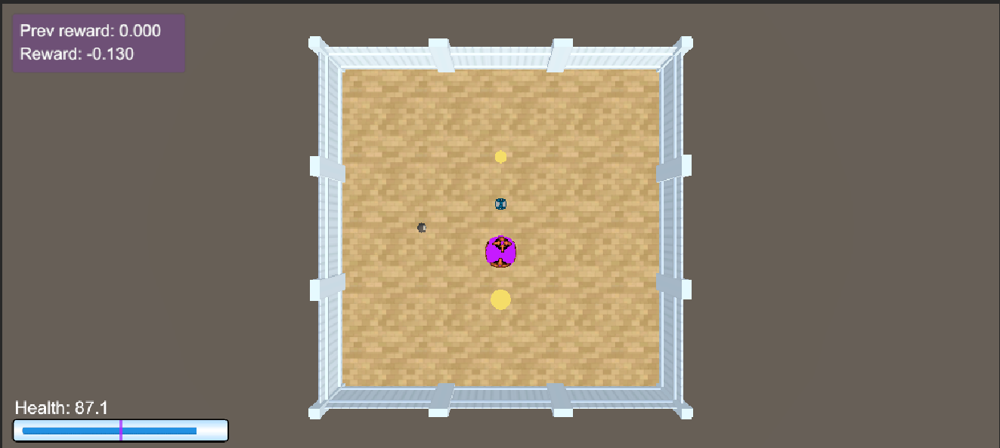
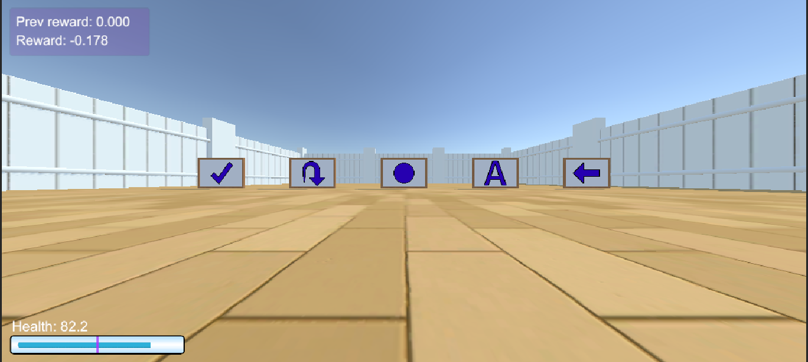
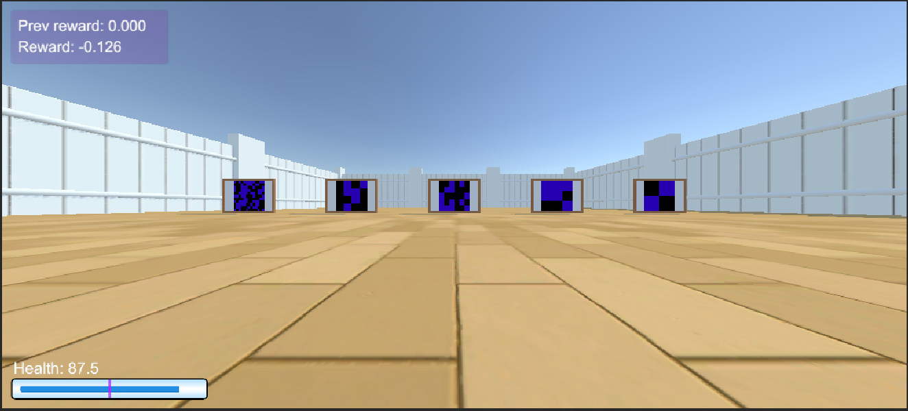
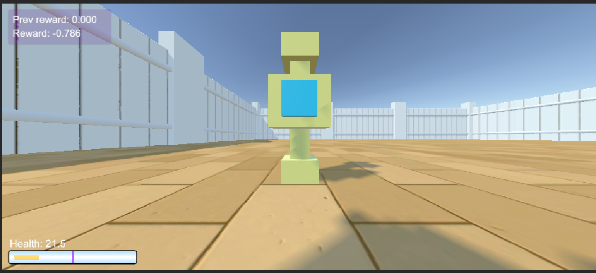
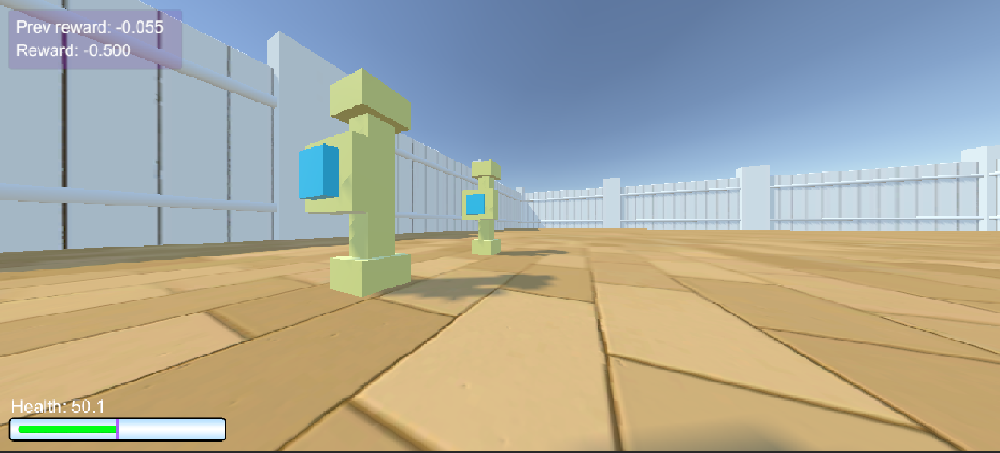
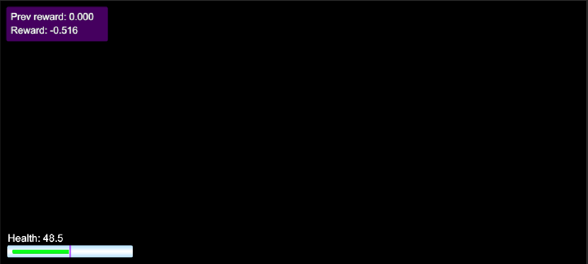

# Detailed Arena Config Guide

#### Table of Contents
1. [Introduction](#introduction)
2. [Understanding YAML Syntax](#understanding-yaml-syntax)
   2.1 [YAML Hierarchical Syntax](#yaml-hierarchical-syntax)
   2.2 [Syntax: Global Parameters](#yaml-hierarchical-syntax-global-parameters)
   2.3 [Syntax: Local Parameters](#yaml-hierarchical-syntax-local-parameters)
3. [EXAMPLES of YAML Configurations](#examples-of-yaml-configurations)
   3.1 [Example 1 - Standard Parameters & Randomisation](#example-1---standard-parameters--randomisation)
   3.2 [Example 2 - Decay Goals / Size-Changing Goals](#example-2---decay-goals--size-changing-goals)
   3.3 [Example 3 - SignBoard (Preset Symbols)](#example-3---signboard-preset-symbols)
   3.4 [Example 4 - SignBoard (Special Symbols)](#example-4---signboard-special-symbols)
   3.5 [Example 5 - SpawnerButton (Interactive Objects)](#example-5---spawnerbutton-interactive-objects)
   3.6 [Example 6 - Multiple Arenas (Randomisation)](#example-6---multiple-arenas-randomisation)
   3.7 [Example 7 - Arena 'Blackouts'](#example-7---arena-blackouts)
4. [Conclusion](#conclusion)
5. [Further Reading and Documentation](#further-reading-and-documentation)


### Introduction

Let's take a look at some examples to understand how to use the YAML syntax in Animal-AI to create custom arenas. Let's take a closer look into the YAML syntax used in Animal-AI itself.


### Understanding YAML Syntax

#### YAML Hierarchical Syntax
```YAML
# note that the arena has a fixed size of 40x40, meaning the size of the arena does not change. 
# in later versions of Animal-AI, the arena size will be configurable. and be set dynamically.
!ArenaConfig
arenas:
  0: !Arena 
  Items: 
    ... # rest of configuration file...
```
**Observations:** 

We can observe the following structure: 

- `!ArenaConfig` is the root tag. 
- `arenas` is the tag for the arenas.
- `0` is the tag for the first arena in the file.
- `!Arena` is the tag for the arena itself.
- `Items` is the tag for the objects to spawn in the arena.

The `!ArenaConfig` tag is used to indicate that the following YAML file is an ArenaConfig file. The `arenas` tag is used to indicate that the following YAML file contains one or more arenas. The `0` tag indicates that the following arena is the first arena in the file, upto `n arenas`. The `!Arena` tag indicates that the following YAML file contains an arena. The `!` tag is used to indicate that the following YAML file is a custom class. In this case, the `!Arena` tag indicates that the following YAML file is an Arena file. The `!Arena` tag is followed by a list of parameters that are used to define the arena, with the objects to spawn for that particular arena only. Some arena parameters are applied locally, such as `t` (time limit) and `pass_mark` (more on this later), while others are applied globally (see below for an example). 

#### YAML Hierarchical Syntax (Global Parameters)
```YAML
!ArenaConfig
# Global Parameters that are optional to put here.
canChangePerspective: false # can the agent change its perspective? (i.e. switch between first-person and third-person view)
canResetEpisode: false # can the agent reset the episode? 
showNotification: false # show the notification to the user upon completion of the episode? 
randomizeArenas: false # randomize the arenas? This applies if there are > 1 arenas in the file. 
arenas:
  0: !Arena
    ... # rest of configuration file...

```
**Observations:** 

We can observe:

- The default values for the global parameters are as follows: `canChangePerspective: true`, `canResetEpisode: true`, `showNotification: false`, and `randomizeArenas: false`.
Bear in mind that the global parameters are optional to define. If we do not define them, the default values are used. 
- If we do not provide global parameters, the default values are used. For example, if we do not provide a value for `canChangePerspective`, the default value of `true` is used.
- If we provide a value for a global parameter, the value is applied to all arenas in the file. For example, if we set `canChangePerspective` to `false`, the agent will not be able to change its perspective in any of the arenas in the file. However, if we set `canChangePerspective` to `true`, the agent will be able to change its perspective in any of the arenas in the file.

In the example above, the global parameters are defined before the arenas. These parameters are applied to all arenas in the file. Please note that these parameters are only applicable during `Play` mode, not agent `Training` mode.

#### YAML Hierarchical Syntax (Local Parameters)
```YAML
!ArenaConfig
arenas:
  0: !Arena
    t: 250 # Time limit for the arena. This is a local parameter, and is only applicable to this arena.
    pass_mark: 0 # Pass mark for the arena (i.e. the minimum reward required to pass the arena). This is a local parameter, and is only applicable to this arena.
    items: # List of objects to spawn in the arena. This is a list which is converted to a GameObject array in Unity.
    - !Item # An individual object to spawn in the arena. This object is then added to the list of objects to spawn in the arena.
      name: Agent
      positions:
      - !Vector3 {x: 10, y: 0, z: 20}
      rotations: [90]
      skins:
      - "hedgehog"
```
**Observations:**

We can observe:

- The local parameters apply from the point at which the arena is defined. In other words, any parameter defined after the `0: !Arena` tag is a local parameter. 

In the above example, the local parameters are defined within the individual arena(s). These parameters are only applicable to the arena in which they are defined. For example, if `t` is set to `250`, the time limit for the arena will be 250 seconds. However, if `t` is set to `500`, the time limit for the arena will be 500 seconds for that arena only. Please note that these parameters are applicable during `Play` and `Training` modes. Lastly, the properties of each "Item" is a local parameter specified for that particular object only. For example, if the `Agent` object is specified to have a `hedgehog` skin, only the `Agent` object will have a `hedgehog` skin for that particular arena.

Let's now take a look at more complex examples to understand how to use the YAML syntax in Animal-AI to create custom arenas.

### Examples of YAML Configurations

Let's take a look at some examples to understand how to use the YAML syntax in Animal-AI to create custom arenas.

#### EXAMPLE 1 - Standard Parameters & Randomisation
```YAML
!ArenaConfig
arenas:
  0: !Arena
    t: 0
    items:
    - !Item
      name: Wall
      positions:
      - !Vector3 {x: 10, y: 0, z: 10}
      - !Vector3 {x: -1, y: 0, z: 30}
      colors:
      - !RGB {r: 204, g: 0, b: 204 }
      rotations: [45, 45]
      sizes:
      - !Vector3 {x: -1, y: 5, z: -1}
      # note that the second wall gameobject has no positions defined, meaning it will be randomly spawned in the arena. 
    - !Item
      name: CylinderTunnel
      colors:
      - !RGB {r: 204, g: 0, b: 204 }
      - !RGB {r: 204, g: 0, b: 204 }
      - !RGB {r: 204, g: 0, b: 204 }
    - !Item
      name: GoodGoal
```

<p align="center">
  
</p>

**Observations:** 
- The number of parameters for `positions`, `rotations`, and `sizes` do not need to match.
- The environment will spawn `max(len(positions), len(rotations), len(sizes))` objects.
- Missing parameters are assigned randomly. For example, if `positions` is specified, but `sizes` are not, the environment will randomly assign sizes values to the objects.

In this scenario, the objects will spawn in the following order:

- A pink Cube will appear at coordinates `[10, 10]` on the ground. It will have a rotation of `45` degrees and its size will be random along the `x` and `z` axes, with a fixed size of `y=5`.
Another Cube will be placed on the ground at a random x coordinate and z=30. This cube's rotation, size, and color will all be randomly determined.
- Three CylinderTunnel objects will spawn next, and each of these will be entirely random in terms of position, size, color, and rotation.
- A GoodGoal object will then appear, with all its attributes randomized.
- Finally, the agent will spawn in a random position and orientation if it is unspecified in the arena instance. This is an important point to note, as if the agent was specified, it would have priority over all other objects and would be spawned first, before any other object(s).

&nbsp;

#### EXAMPLE 2 - Decay Goals / Size-Changing Goals
```YAML
!ArenaConfig
arenas:
  0: !Arena
    pass_mark: 0
    t: 250
    items:
    - !Item
      name: Agent
      positions:
      - !Vector3 {x: 10, y: 0, z: 20}
      rotations: [90]
      skins:
      - "hedgehog"
    - !Item
      name: ShrinkGoal
      positions:
      - !Vector3 {x: 20, y: 0, z: 11}
      sizes:
      - !Vector3 {x: 0.1, y: 0.1, z: 0.1}
      symbolNames:
      - "left-arrow"
      initialValues: [2.5]
      finalValues: [1.5]
      delays: [400]
      changeRates: [-0.2]
    - !Item
      name: DecayGoal
      positions:
      - !Vector3 {x: 20, y: 0, z: 17}
      initialValues: [4]
      finalValues: [3]
      delays: [250]
      changeRates: [-0.003]
    - !Item
      name: AntiDecayGoal
      positions:
      - !Vector3 {x: 20, y: 0, z: 23}
      sizes:
      - !Vector3 {x: 0.1, y: 0.1, z: 0.1}
      initialValues: [1]
      finalValues: [1.5]
      delays: [300]
      changeRates: [-0.007]
    - !Item
      name: GrowGoal
      positions:
      - !Vector3 {x: 20, y: 0, z: 29}
      initialValues: [1]
      finalValues: [3.5]
      delays: [100]
      changeRates: [0.01]
```

<p align="center">
  
</p>

**Observations:**

This example showcases various goals that undergo changes such as `decay`, `growth`, `shrinkage`, and `ripening` (anti-decay). Each Item in this setup includes certain parameters that are either irrelevant or used incorrectly. These 'red herring' parameters, while not utilized properly, do not impact the overall outcome or cause issues with the AAI environment.

In the above scenario:

- The `ShrinkGoal` and `GrowGoal` ignore the declared `sizes` parameter. Instead, their sizes change based on the initialValues and finalValues.
- For both `DecayGoal` and `AntiDecayGoal`, the size is determined by the larger of the `initialValue` or `finalValue`. 
- Additionally, the reward for these goals transitions from the initial value to the final value over time.
Interestingly, the ShrinkGoal includes a `symbolNames` parameter, which is typically reserved for `SignBoard` objects. This parameter is not applicable here and is therefore disregarded.
- Furthermore, an 'animal skin' feature is utilized in this example. Specifically, the Agent is configured to always appear with a 'hedgehog' skin.

&nbsp;

#### EXAMPLE 3 - SignBoard (Preset Symbols)
```YAML
!ArenaConfig
arenas:
  0: !Arena
    pass_mark: 0
    t: 250
    items:
    - !Item
      name: Agent
      positions:
      - !Vector3 {x: 10, y: 0, z: 20}
      rotations: [90]
    - !Item
      name: SignBoard
      positions: # note that the positions, rotations, and sizes parameters must be of the same length 
      # ...(i.e. if there are 5 positions, there must be 5 rotations and 5 sizes).
      - !Vector3 {x: 20, y: 0, z: 8}
      - !Vector3 {x: 20, y: 0, z: 14}
      - !Vector3 {x: 20, y: 0, z: 20}
      - !Vector3 {x: 20, y: 0, z: 26}
      - !Vector3 {x: 20, y: 0, z: 32}
      rotations: [0, 0, 0, 0, 0]
      sizes:
      - !Vector3 {x: 1, y: 1, z: 1}
      - !Vector3 {x: 1, y: 1, z: 1}
      - !Vector3 {x: 1, y: 1, z: 1}
      - !Vector3 {x: 1, y: 1, z: 1}
      - !Vector3 {x: 1, y: 1, z: 1}
      symbolNames: # note also that the symbolNames parameter must be of the same length as the positions parameters 
      # ...(i.e. if there are 5 positions, there must be 5 symbolNames). Each position is an instance of a SignBoard object, and each SignBoard object can only have one symbol.
      - "left-arrow"    
      - "letter-a"    
      - "circle"    
      - "u-turn-arrow"    
      - "tick"
```

<p align="center">
  
</p>

**Observations:**

This example illustrates how to employ predefined symbols using the `symbolNames` parameter, which is exclusive to `SignBoard` objects. Each symbol in this list comes with a default color. However, these colors do not affect the texture of the symbol. Instead, the color of the SignBoard gameobject is determined by the `colors` parameter and only that.

&nbsp;

#### EXAMPLE 4 - SignBoard (Special Symbols)
```YAML
!ArenaConfig
arenas:
  0: !Arena
    pass_mark: 0
    t: 250
    items:
    - !Item
      name: Agent
      positions:
      - !Vector3 {x: 10, y: 0, z: 20}
      rotations: [90]
    - !Item
      name: SignBoard
      positions:
      - !Vector3 {x: 20, y: 0, z: 8}
      - !Vector3 {x: 20, y: 0, z: 14}
      - !Vector3 {x: 20, y: 0, z: 20}
      - !Vector3 {x: 20, y: 0, z: 26}
      - !Vector3 {x: 20, y: 0, z: 32}
      rotations: [0, 0, 0, 0, 0]
      sizes:
      - !Vector3 {x: 1, y: 1, z: 1}
      - !Vector3 {x: 1, y: 1, z: 1}
      - !Vector3 {x: 1, y: 1, z: 1}
      - !Vector3 {x: 1, y: 1, z: 1}
      - !Vector3 {x: 1, y: 1, z: 1}
      symbolNames:
      - "01/10"    
      - "111/110/001"    
      - "001010/011000/100001/101010/111001"    
      - "0101/**10/0010/0***"
      - "13x11"
```

<p align="center">
  
</p>

**Observations:**

This example demonstrates the use of *special codes* to generate black-and-white pixel grids to use as symbols. `0` -> black, `1` -> white, and `*` is a 'joker' character that chooses to output black or white at random. The dimensions of the grid are given by the `/` character - each row between `/`s must be of the same size for the code to be valid. 

Fully-random grids can be generated using the code `"MxN"`, where `M` and `N` are the grid width and height dimensions respectively. For example, `"5x3"` will generate a 5x3 grid.

&nbsp;

#### EXAMPLE 5 - SpawnerButton (Interactive Objects)
```YAML
!ArenaConfig
arenas:
  0: !Arena
    pass_mark: 0
    t: 250
    items:
    - !Item
      name: Agent
      positions:
      - !Vector3 {x: 10, y: 0, z: 20}
      rotations: [90]
    - !Item
      name: SpawnerButton
      positions:
      - !Vector3 {x: 10, y: 0, z: 10}
      sizes:
      - !Vector3 {x: 5, y: 5, z: 5}
      rotations: [0]
      # colors:
      # - !RGB {r: 204, g: 0, b: 204 }
      # note that the SpawnerButton is a modular object, but the colors are fixed for each module in order to remove the
      # ...occurance of each module having the same color, which would be confusing for the player/agent on which module to interact with.
      moveDurations: [0.1] 
      resetDurations: [1.0] 
      rewardNames: ["GoodGoal", "BadGoal", "GoodGoalMulti"]
      rewardWeights: [100, 0, 0] 
      spawnProbability: 1.0 
      maxRewardCounts: [-1, -1, -1] 
      rewardSpawnPos: !Vector3 {x: 25, y: 0, z: 23} # the position where the reward will be spawned. 
```

<p align="center">
  
</p>

**Observations:** 

- The `SpawnerButton` object is an interactive object, meaning that it can be interacted with by the player/agent.
- The `SpawnerButton` object is a modular object, meaning that it is made up of multiple modules. In this case, the `SpawnerButton` object is made up of 2 modules.

In the above example, the `SpawnerButton` object is used to spawn rewards upon interaction with the button (by 'colliding' with the gameobject) by the player/agent. We can observe that the `SpawnerButton` object has a number of parameters that are used to define the object's behaviour. These parameters are as follows:

- `moveDurations`: The duration of the movement of the button when it is pressed.
- `resetDurations`: The duration of the movement of the button when it is reset.
- `rewardNames`: The list of rewards that can be spawned.
- `rewardWeights`: The weights of each reward in the rewards list. 
As an added feature, the weights can be used to control the probability of spawning each reward. For example, if the weights are `[100, 0, 0]`, the probability of spawning the first reward is 100%, while the probability of spawning the second and third rewards are 0%. If the weights are `[50, 50, 0]`, the probability of spawning the first and second rewards are 50%, while the probability of spawning the third reward is 0%. If the weights are `[33, 33, 33]`, the probability of spawning each reward is 33%.
- `spawnProbability`: The probability of spawning the reward upon interaction with the SpawnerButton. This parameter is used in conjunction with the `rewardWeights` parameter. Essentially, it controls the overall probability of spawning _a_ reward upon interaction with the SpawnerButton. For example, if you have the `rewardWeights` set to `[100, 100, 100]` but the `spawnProbability` set to `0.5`, the probability of spawning a reward is 50% at each interaction. Conversely, if you have the `rewardWeights` set to `[100, 100, 100]` but the `spawnProbability` set to `0.0`, the probability of spawning a reward is 0% at each interaction, meaning no reward will ever be spawned. 
- `maxRewardCounts`: The maximum number of times each reward can be spawned. A value of -1 means no limit to the number of times the reward can be spawned per episode.
- `rewardSpawnPos`: The position where the reward will be spawned. If left unspecified, the reward will be spawned randomly within the arena.

&nbsp;

#### EXAMPLE 6 - Multiple Arenas (Randomisation)
```YAML
!ArenaConfig
randomizeArenas: true # Here, we set randomizeArenas to true, which means that the arenas will be randomized upon play. Note that this is not applicable to training mode.
arenas:
  0: !Arena
    pass_mark: 0
    t: 250
    items:
    - !Item
      name: Agent
      positions:
      - !Vector3 {x: 10, y: 0, z: 20}
      rotations: [90]
    - !Item
      name: SpawnerButton
      positions:
      - !Vector3 {x: 20, y: 0, z: 8}
  1: !Arena # Here, we define a second arena. However, for simplicitiy, the second arena has the same objects and parameters as the first arena.
    pass_mark: 0
    t: 250
    items:
    - !Item
      name: Agent
      positions:
      - !Vector3 {x: 10, y: 0, z: 20}
      rotations: [90]
    - !Item
      name: SpawnerButton
      positions:
      - !Vector3 {x: 20, y: 0, z: 8}
    - !Item
      name: SpawnerButton
      - !Vector3 {x: 27.9799995, y: 0, z: 7.99999905}
```

<table>
  <tr>
    <td>
    <p>Arena 0 </p></td>
    <td><p>Arena 1</p></td>
  </tr>
</table>

**Observations:** 

We can observe that:

- If we set `randomizeArenas` to `false`, the arenas will not be randomized upon play. Instead, the arenas will be played in the order in which they are defined in the file. For example, if we set `randomizeArenas` to `false`, the first arena will be played first, followed by the second arena.
- If we set `randomizeArenas` to `true`, the arenas will be randomized upon play and played in a random order. Regardless of the order in which the arenas are defined in the file, the arenas will be recycled (start from the beginning again) when every arena has been cycled through once.

In this example, we define two arenas. However, we set `randomizeArenas` to `true`, which means that the arenas will be randomized upon play. Note that this is not applicable to training mode. This means that the order in which the arenas are defined does not matter, as the arenas will be randomized upon play. Please note that the `randomizeArenas` parameter is only applicable to the arenas in the file, not the objects within the arenas. 

&nbsp;

#### EXAMPLE 7 - Arena 'Blackouts'
```YAML
!ArenaConfig
arenas:
  0: !Arena
    t: 250 
    pass_mark: 50 
    items:
    - !Item
      name: Agent
      positions:
      - !Vector3 {x: 10, y: 0, z: 20}
      rotations: [90]
      skins:
      - "pig"
    blackouts: [10, 43, 50, 20] # here, we are defining the blackout times (in frames) for the arena at frames 10, 43, 50 and 20.
```

<p align="center">
  
</p>

**Observations:** 

We can observe that:

- The `blackouts` parameter is used to define the blackout zones for the arena. The `blackouts` parameter is a list of frames at which the arena will be blacked out. For example, if we set `blackouts` to `[10, 43, 50, 20]`, the arena will be blacked out at frames 10, 43, 50 and 20. This means the player/agent will be virtually blind at these frames (no light will be emitted to the arena).
- Additionally, if we set `blackouts` to `[-20]`, the arena will blackout every 20 frames (because we placed the '-' indicating repeat).
- The blackout has no effect on any other aspect of the agent or the arena. For example, the agent will still be able to move around the arena, and the objects in the arena will still be visible to the agent. _RayCasting_ will still work. 

### Conclusion

We hope that this guide has helped you understand how to use the YAML syntax in Animal-AI to create custom arenas. If you are still unsure about how to use the YAML syntax, please refer to the [Background-YAML](docs\Background-YAML.md) guide and/or [Background-Unity](docs\Background-Unity.md) guide for a closer look into how YAML is used.

### Further Reading and Documentation

For more information on how YAML works, please refer to the [YAML documentation](https://yaml.org/spec/1.2/spec.html). Also, we have provided a starter background guide to YAML [here](YAML-Background.md).

---